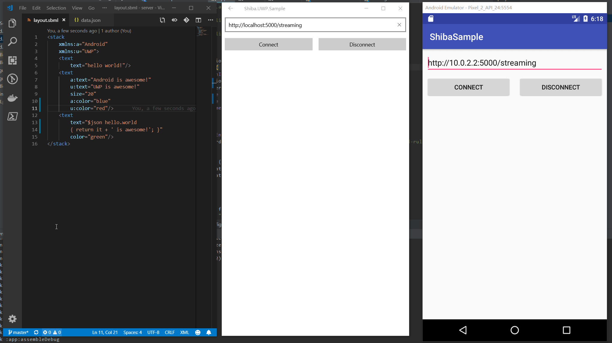

[English](README.md) | [中文](README.zh.md)
# Status  
| Platform |  Build Status |  Download |
|:---:|:---:|:---:|
| UWP |[](https://ci.appveyor.com/project/ShibaJS/shiba/branch/master) | [](https://badge.fury.io/nu/Shiba)|
| Android |[](https://travis-ci.com/ShibaJS/Shiba)|[](https://bintray.com/tlaster/Shiba/Shiba/_latestVersion) |  

**Shiba is still in development and is not production-ready** 

# Show Case


# Getting Start

## For UWP:
You can install from nuget
```
dotnet add package Shiba
```
And call the initialization (Better from your App's OnLaunched):  
```
ShibaApp.Init();
```

## For Android:
```
implementation 'moe.tlaster:shiba:0.1.+'
```
And call the initialization (Better from your App's onCreate):  
```
Shiba.init(this)
```

## iOS and others:
Still working on it, you can add your PR to help me

## Notes
All the initialization can be called from anywhere, e.g. you want delay initialization, just call it before actually using Shiba

## More
WIP

# Goal
Not like other cross-platform frameworks, Shiba is **NOT** a framework to replace the native development, Shiba will let you take both of the advantages of cross-platform and native.  
Shiba will also provide an easy way to define your custom layout.  
You can mix your native code with Shiba, you can also use Shiba to create a simple application without writing native code. 

# LICENSE
The MIT License (MIT)

Copyright (c) 2018

Permission is hereby granted, free of charge, to any person obtaining a copy of this software and associated documentation files (the "Software"), to deal in the Software without restriction, including without limitation the rights to use, copy, modify, merge, publish, distribute, sublicense, and/or sell copies of the Software, and to permit persons to whom the Software is furnished to do so, subject to the following conditions:

The above copyright notice and this permission notice shall be included in all copies or substantial portions of the Software.

THE SOFTWARE IS PROVIDED "AS IS", WITHOUT WARRANTY OF ANY KIND, EXPRESS OR IMPLIED, INCLUDING BUT NOT LIMITED TO THE WARRANTIES OF MERCHANTABILITY, FITNESS FOR A PARTICULAR PURPOSE AND NONINFRINGEMENT. IN NO EVENT SHALL THE AUTHORS OR COPYRIGHT HOLDERS BE LIABLE FOR ANY CLAIM, DAMAGES OR OTHER LIABILITY, WHETHER IN AN ACTION OF CONTRACT, TORT OR OTHERWISE, ARISING FROM, OUT OF OR IN CONNECTION WITH THE SOFTWARE OR THE USE OR OTHER DEALINGS IN THE SOFTWARE.
