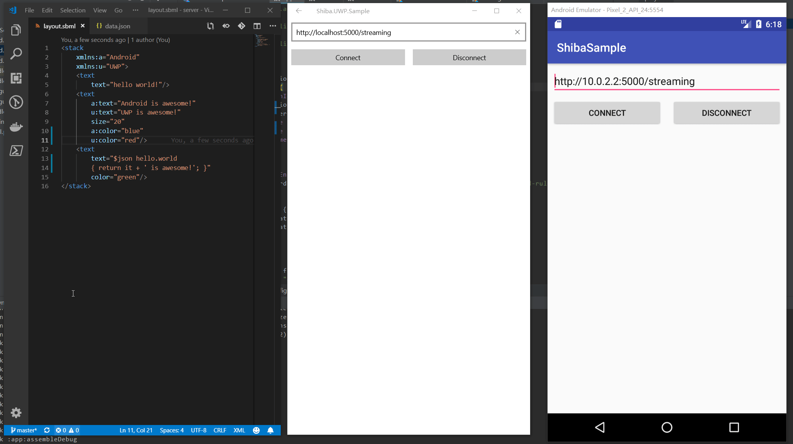

[English](README.md) | [中文](README.zh.md)
# 包状态  
| Platform |  Build Status |  Download |
|:---:|:---:|:---:|
| .Net |[](https://ci.appveyor.com/project/Tlaster/shiba) | [](https://badge.fury.io/nu/Shiba)|
| Android |[](https://travis-ci.com/Tlaster/Shiba)|[](https://bintray.com/tlaster/Shiba/Shiba/_latestVersion) |  

**Shiba 仍处于并将长期处于开发初级阶段,不建议过早的将其引入生产环境中** 

# 预览


# 如何开始

## WPF/UWP/Xamarin.Forms:
从 Nuget 上安装
```
dotnet add package Shiba
```
记得初始化 (最好在 App 的 OnLaunched 方法内):  
```
ShibaApp.Init();
```

## Android:
```
implementation 'moe.tlaster:shiba:0.0.+'
```
记得初始化 (最好在 App 的 onCreate 方法内):  
```
Shiba.init(this)
```

## iOS 和其他平台:
仍在开发中,你可以提起你的 PR 来帮助我

## Notes
初始化方法可在任意位置调用,比如你需要延迟初始化来提高你的程序启动速度,只要你在真正使用 Shiba 之前调用即可

## 更多
[参见文档](doc/GettingStart.zh.md)

# 目标
不像其他跨平台框架, Shiba **不是**用于取代原生开发的框架, Shiba 将会让你同时获得跨平台和原生开发的优点。  
Shiba 也会提供一个简单的方法自定义你自己的 Layout。  
你可以在你现有项目中加入 Shiba 并于现有代码共存,也可以创建一个无需编写任何原生代码程序  

# LICENSE
The MIT License (MIT)

Copyright (c) 2018

Permission is hereby granted, free of charge, to any person obtaining a copy of this software and associated documentation files (the "Software"), to deal in the Software without restriction, including without limitation the rights to use, copy, modify, merge, publish, distribute, sublicense, and/or sell copies of the Software, and to permit persons to whom the Software is furnished to do so, subject to the following conditions:

The above copyright notice and this permission notice shall be included in all copies or substantial portions of the Software.

THE SOFTWARE IS PROVIDED "AS IS", WITHOUT WARRANTY OF ANY KIND, EXPRESS OR IMPLIED, INCLUDING BUT NOT LIMITED TO THE WARRANTIES OF MERCHANTABILITY, FITNESS FOR A PARTICULAR PURPOSE AND NONINFRINGEMENT. IN NO EVENT SHALL THE AUTHORS OR COPYRIGHT HOLDERS BE LIABLE FOR ANY CLAIM, DAMAGES OR OTHER LIABILITY, WHETHER IN AN ACTION OF CONTRACT, TORT OR OTHERWISE, ARISING FROM, OUT OF OR IN CONNECTION WITH THE SOFTWARE OR THE USE OR OTHER DEALINGS IN THE SOFTWARE.
